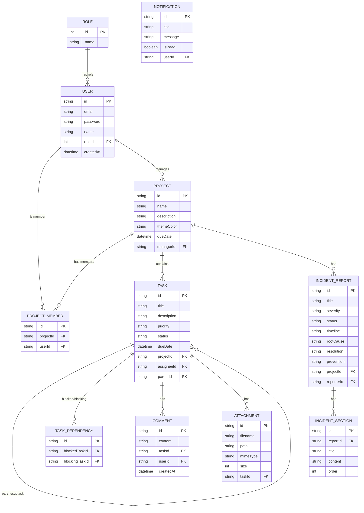
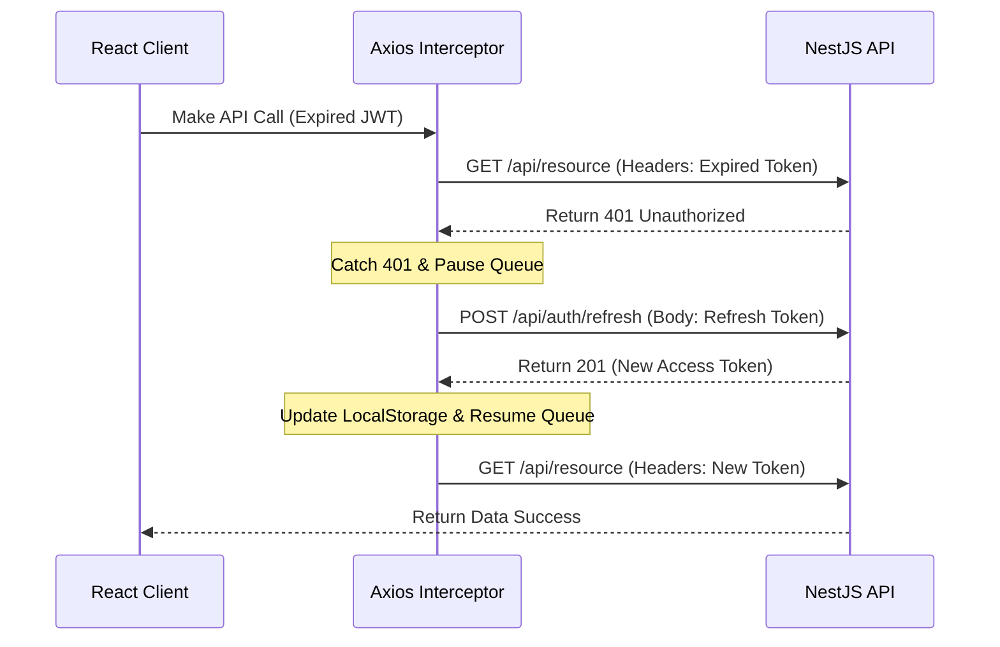

# SprintNest – Architecture & Design Documentation

This document explains the technical architecture, design decisions, and system blueprints behind the SprintNest platform.

---

## 🏛️ System Architecture

SprintNest uses a **decoupled Client-Server Architecture** built with modern developer workflows in mind.

```mermaid
graph TD
    subgraph Client Application (React)
        A[React UI Components] --> B[AuthContext & State]
        B --> C[API Client Wrapper Axios]
        C --> D[Socket.io Client]
    end

    subgraph Backend Server (NestJS Monolith)
        E[NestJS Controllers] --> F[NestJS Services]
        F --> G[Prisma Repositories]
        H[Socket.io Gateway] --> F
    end

    subgraph Database
        I[(PostgreSQL DB)]
    end

    C -->|HTTP REST + JWT| E
    D <-->|WebSockets| H
    G -->|Prisma Client| I
```

### 1. Backend Architecture (NestJS)
The backend is structured as a **Modular Monolith** using NestJS, ensuring domain isolation and scalability.
*   **Modules**: Each business capability (Auth, Projects, Tasks, Incidents, Reports, Dashboard, Notifications) is encapsulated in its own module directory.
*   **Controller-Service-Repository Pattern**:
    *   **Controllers**: Handle client HTTP requests, validate query parameters, and enforce JWT security filters.
    *   **Services**: Implement business logic, manage transaction workflows, and assert rule validations.
    *   **Repositories**: Encapsulate database interactions using **Prisma ORM**, keeping database queries isolated.

### 2. Frontend Architecture (React)
*   **State Management**: Context-based state management (`AuthContext`) tracks current user profiles, JWT storage, theme setups, and active configurations.
*   **Vite Pipeline**: Provides near-instant hot module replacement (HMR) and optimized minified code bundling.
*   **Tailwind CSS v4 & Styling**: Styled using light/dark glassmorphic design systems with utility classes and custom layout properties.

---

## 🗄️ Database Design (Entity Relationship Diagram)

SprintNest uses PostgreSQL as its main database, modeled via Prisma schema declarations.



---

## 🔑 Key Design Decisions & Tradeoffs

### 1. Token Refresh Interceptor Flow
To maintain secure session management without forcing frequent logins, the application uses an Axios HTTP interceptor:



### 2. Task Dependency Business Rules
*   **Decision**: Block task status transitions to `DONE` if parent tasks or dependency blocking tasks are in a non-completed state (`TODO`, `IN_PROGRESS`, `REVIEW`).
*   **Tradeoff**: This limits absolute user freedom in updating Kanban boards, but enforces strict milestone compliance necessary for software engineering workflows.

### 3. Isolated Incident Workflows
*   **Decision**: Only Managers or Admins can submit drafts, approve files, or close incident reports. Developers can log draft reports but cannot self-approve.
*   **Rationale**: Enforces SOX compliance and ensures proper incident resolution and root cause logs.
